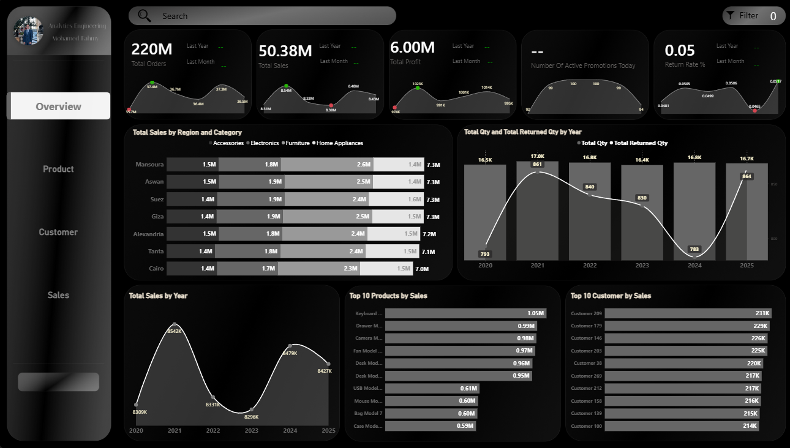
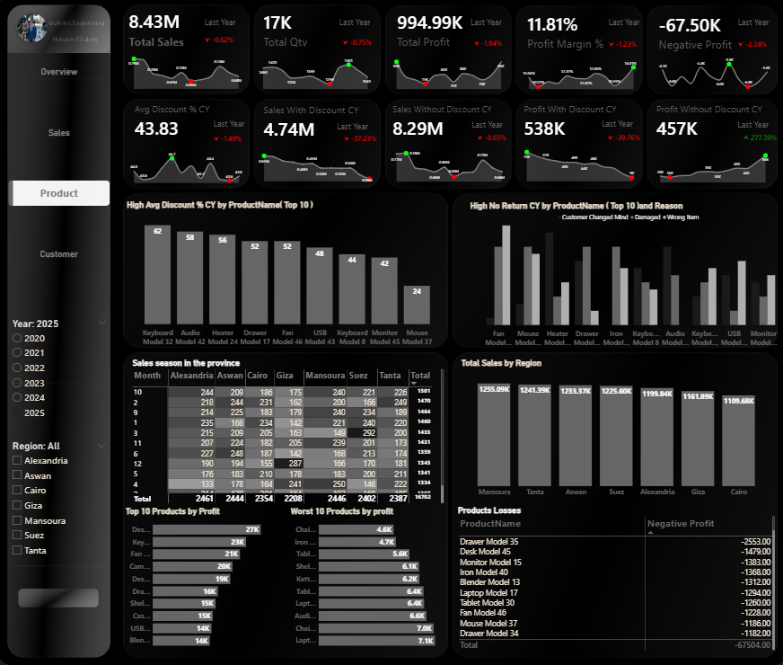
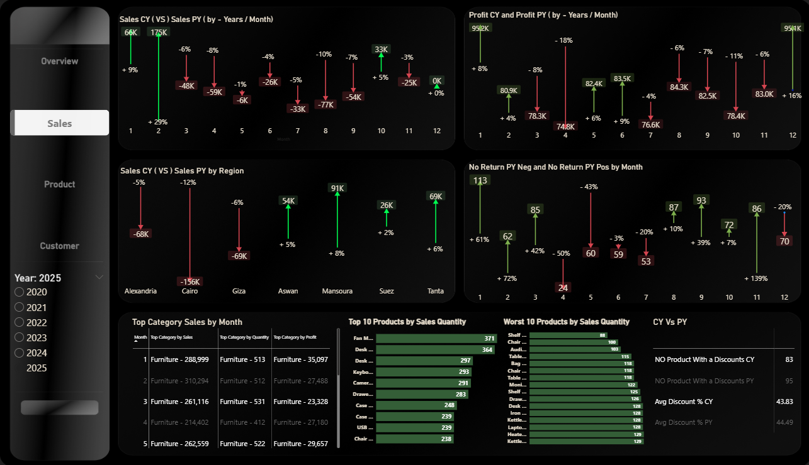

# Sales Analytics Power BI Project
## 🎯 Project Objective

The primary objective of this project is to deliver comprehensive and actionable insights into business performance through a set of interactive and dynamic Power BI dashboards.
By visualizing key sales, product, and customer metrics, the dashboards enable stakeholders to effectively monitor performance, identify trends, uncover issues, and make data-driven decisions that support business growth and operational efficiency.

The project focuses on four key analytical areas:
- Overall business performance (Executive Overview)
- Sales performance and trends
- Product performance and discount impact
- Customer behavior, retention, and lifetime value
- Profit Growth Recommendations – Executive Summary

This project aims to enhance decision-making capabilities, improve performance monitoring, optimize sales and pricing strategies, and support long-term business planning through reliable and insightful analytics.

##ئThe project consists of **four main dashboards**:
1. Overview Dashboard
2. Sales Performance Dashboard
3. Product Performance Dashboard
4. Customer Performance Dashboard

---

## 🧩 Dashboards Breakdown

### 
Key Performance Indicators (KPIs):
- Total Orders: 22k
- Total Sales: 50.38M
- Total Profit: 6.00M
- Active Promotions Today: 0
- Return Rate: 0.05%
📌 Purpose: Executive summary for decision-makers

🛒 Overall Business Performance:
- The business is operating at a very large scale, with 22k orders generating over 50 million in total sales. This reflects strong and sustained customer demand across all channels.
- Despite the high volume, the company maintains a healthy profit of 6 million, which indicates good cost control and efficient operations.

🌍 Regional & Category Performance

- Sales are well-balanced across regions, with cities like Mansoura, Aswan, Suez, and Giza all contributing nearly the same total sales.
**Across all regions:**
1- Electronics is the top-performing category
2- Furniture consistently ranks second
3- Home Appliances contribute the least
This shows a clear customer preference toward technology and electronic products.

📦 Sales Volume & Returns Trend

From 2020 to 2025:

- Total quantity sold remains stable (around 16.5K–17K units annually)
- Returned quantities peaked in 2021, then steadily declined
- This trend indicates continuous improvement in:
  * Product selection
  * Supply chain efficiency
  * Customer expectation alignment

📈 Sales Trend Over Time

- Sales peaked in 2021, followed by a noticeable decline in 2022 and 2023.
- However, the business showed a strong recovery in 2024, with sales stabilizing again in 2025.
- This tells a story of resilience, where the company successfully adapted after a downturn and regained momentum.

🏆 Product Performance
 - The Top 10 Products by Sales are dominated by electronic items such as:
  * Keyboards
  * Cameras
  * Fans
  * Desk-related products
Sales are evenly distributed among these products, which reduces dependency on a single product and lowers business risk.

🤝 Customer Contribution

- The Top 10 Customers contribute similar sales values, with no single customer dominating total revenue.

- This indicates:

 * Strong customer diversification
 * Healthy repeat-purchase behavior
 * Low dependency risk on individual clients

---

### 
📌 Insights and Recommendation
1- High-Performing Product with Discount Issues(Desk Model 47 – Top Product in 2025) 
 **Problem**
 - Desk Model 47 was the top-selling product in 2025, achieving 16% higher sales compared to last season.
 However, the product faced discount-related issues:
- The discount rate decreased by 5% compared to last year.
- During discount periods: (Sales dropped by 50%) , (Profit decreased by 30%)
- Discounts created a negative and reversed impact.
- In non-discount periods: (Sales increased by 0.5%) , (Profit increased 12x compared to last year’s non-discount period)
- September recorded the lowest units sold.
This indicates that discounts were poorly optimized and harmed both sales and profitability.  
**Solution / Recommendation**
  - Re-evaluate the discount strategy for high-performing products.
  - Reduce or eliminate unnecessary discounts where organic demand is strong.
  - Apply region-based discounting, offering targeted promotions only in low-performing regions (Aswan, Suez).
  - Maintain current pricing and discount levels in high-performing regions and months.
  - Avoid aggressive discounting during historically weak months like September.
2- Lowest-Selling Product Across Multiple Regions
  **Problem**
    One product recorded very low sales performance:
    - No sales at all in Mansoura
    - Weak sales in Cairo, Alexandria, and Aswan
    This indicates low customer acceptance and poor market fit in key regions.
  **Solution / Recommendation**
    - Investigate regional customer preferences and demand drivers.
    - Adjust pricing or introduce controlled discounts in underperforming regions.
    - Reposition the product or bundle it with stronger products to increase exposure.
    - Consider reducing inventory or discontinuing the product in regions with zero demand.
3- Highly Discounted Product with Seasonal Dependency
    **Problem**
      - The product with the highest discount rate showed:
          * Increase in sales 46%
          * Profit was only 2.9% lower than last year
          * Discount rate increased by 30% compared to last year
      - However, major issues were identified:
          * Discount was active all year long
          * Sales occurred only in September and October
          * Zero sales in other months due to:
            - Product being seasonal
            - A competing product from the same category dominating sales outside the season
            - High return rates outside the season
            - Customers did not perceive value in the product, even with discounts
     **Solution / Recommendation**
        - Stop year-round discounting and apply discounts only during the product’s peak season.
        - Implement product bundling strategy:
            - Bundle the strong product with the weak seasonal product.
            - Force combined purchase to increase weak product sales.
        - Eliminate discounts outside the season to protect profit margins.
        - Apply region-specific seasonal pricing, as seasonality impact differs by governorate.
        - Focus sales efforts on underperforming regions such as Aswan and Suez.
4- Low Sales Due to Pricing and Discount Absence
    **Problem**
    - The lowest-selling product suffered from two main issues:
        * No discounts were applied during the year, unlike last year when discounts drove strong sales.
        * During high-price periods, sales were very weak.
        * Sales improved only in months where pricing was more competitive.
      This shows high price sensitivity for this product.
    **Solution / Recommendation**
     - Reintroduce selective and time-bound discounts similar to last year’s strategy.
     - Avoid premium pricing during low-demand months.
     - Optimize pricing based on historical performance by month.
     - Use dynamic pricing to align product price with customer willingness to pay.

---

### 
KPI:
- Active, New, Lost, Returning Customers
- Customer Lifetime Value (CLV)
- Average Order Value (AOV)
- Purchase Frequency

📌 Insights and Recommendation
1- High Customer Acquisition but Low Retention
**Problem**
    - The company is successful at acquiring new customers, but a significant portion of them is lost quickly after the first purchase.
    - The company is successful at acquiring new customers, but a significant portion of them is lost quickly after the first purchase. 
        * The product has a long purchase cycle and is not consumable, as indicated by a Purchase Frequency of 1.5.
        * Customers show low loyalty, purchasing mainly during discount periods.
        * Discounts do not increase purchase frequency, which proves that customers are price-driven rather than brand-loyal. 
      This results in weak customer lifetime value and high churn
  **Solution / Recommendation**
      - Shift focus from repeat purchases to customer referral acquisition.
      - Turn existing customers into brand advocates by:
        * Following up after purchase
        * Solving post-purchase issues quickly
        * Offering personalized support and selective incentives
        * Invest in post-purchase engagement rather than frequency-based discount campaigns.

 2- Increasing Average Order Value with Decreasing Purchase Frequency
  **Problem** 
     - The Average Order Value (AOV) increased, while Purchase Frequency decreased.
     - This indicates that:
       * Customers are buying less often
       * But spending more per transaction
      While revenue per order is growing, long-term engagement is weakening.
  **Solution / Recommendation**
    - Focus on maximizing basket size per transaction.
    - Encourage customers to buy more items in a single order through:
      * Product bundles
      * Cross-selling and up-selling strategies
      * Volume-based offers (e.g., buy more, save more)
      * Accept the long repurchase cycle and optimize revenue per purchase instead of per customer visit.

---

### 
📌 Insights 
1- Sales performance in 2025 shows negative YoY growth in most months compared to the previous year.
 - Several months recorded sales declines ranging from -4% to -10%.
 - The weakest performance was concentrated in mid-year months, indicating seasonality or ineffective pricing/promotion strategies.
 - Only limited months showed positive or neutral growth.
2- Profit performance fluctuated significantly across months:
   - Some months showed double-digit profit declines (up to -18%).
   - Profit drops were more severe than sales drops, indicating margin pressure.
   - This suggests inefficient discounting or increased operational costs.
3- Sales performance varies significantly by region:
  - Negative growth in Cairo, Alexandria, and Giza.
  - Positive growth in Aswan, Mansoura, Suez, and Tanta.
  - Cairo experienced the largest YoY decline, indicating market saturation or pricing issues.
4- Return behavior shows high volatility:
  - Some months recorded sharp increases in no-return counts, while others dropped significantly.
  - April showed a major decline in no-return performance, indicating higher return rates.
  - This inconsistency affects customer trust and operational efficiency.
5- Furniture dominates:
  - Monthly sales
  - Sales quantity
  - Profit contribution
This creates category concentration risk, making overall performance sensitive to one category.
6- Sales quantity is heavily concentrated in the Top 10 Products, while the Worst 10 Products show extremely weak performance.
  - Indicates inefficient product portfolio utilization.
  - Low-performing products consume inventory without contributing to revenue.
7- Average discount percentage decreased slightly in CY compared to PY.
   - The number of products without discounts increased.
   - Despite discounts, sales and profit did not consistently improve.
This indicates inefficient discount allocation. 

---

# 📈 Profit Growth Recommendations – Executive Summary
1- Recalibrate Promotions Strategy (Top Priority)
**Problem**
  - Excessive discounting across products
  - No real increase in sales volume
  - Discounts are eroding profit margins
Promotions are being used broadly without clear ROI, leading to margin loss instead of growth.
**Solution**
  - Shift from mass promotions to smart, targeted promotions.
**Key Actions**
  - Stop applying discounts on high-return products
  - Focus promotions only on:
      * Low turnover products
      * Old or slow-moving stock
  - Reduce promotion duration instead of increasing discount depth
**Expected Impact**
  - Protect profit margins
  - Improve promotion ROI
  - Reduce unnecessary revenue leakage

2- Replace Discounts with Bundling Strategies
**Problem**
  - Single-product discounts reduce margins
  - Limited impact on quantity sold
**Solution**
  - Use bundles instead of direct discounts.
**Recommended Approach**
  - Instead of:(20% discount on a single product)
  - APPLY --->>>>  Buy 2 Get 1 , Product bundles (High-margin + Low-margin products)
**Why This Works**
  - Increases total quantity sold
  - Raises Average Order Value (AOV)
  - Preserves overall margin
**Expected Impact**
  - Higher revenue per transaction
  - Better inventory movement
  - Reduced dependency on price cuts

3- Reduce Returns (Major Hidden Profit Leak)
**Problem**
  Returns are silently consuming profits through:
    - Reverse logistics costs
    - Lost revenue
    - Inventory handling overhead
**Solution**
  - Treat returns as a profit protection initiative, not an operational issue only.
**Actionable Fixes**
  - Analyze return reasons by product and month
  - Stop promotions on products with:
    * High return rates
**Expected Impact**
  - Lower operational costs
  - Higher net profit
  - Improved customer satisfaction 
